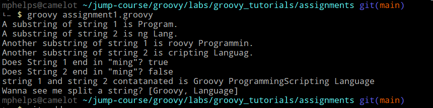
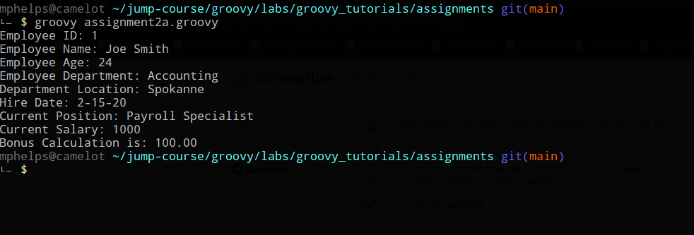
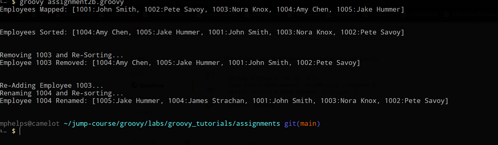
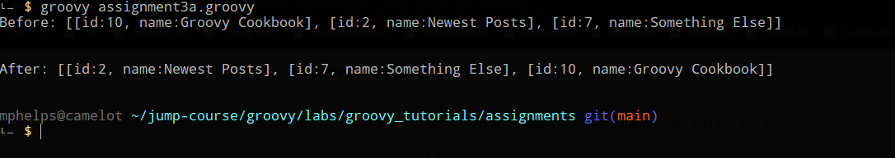
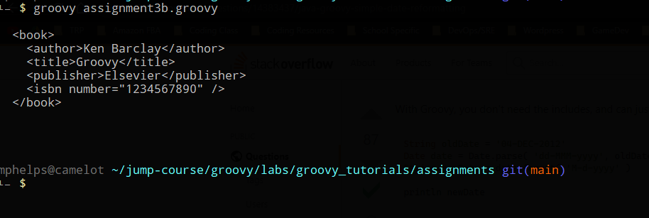
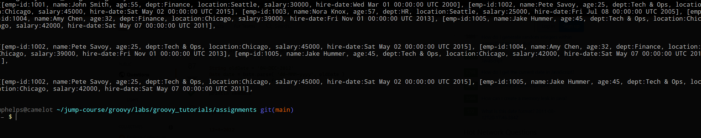

### Groovy Assignments
## Michael Phelps
---
# Assignment 1 
[Repo Link]([./assignment1.groovy](https://github.com/JumpCourseLabs/groovy_tutorials/blob/main/assignments/assignment1.groovy))
RunTime Result:

---
# Assignment 2a
[Repo Link]([./assignment2a.groovy](https://github.com/JumpCourseLabs/groovy_tutorials/blob/main/assignments/assignment2a.groovy))
RunTime Result:

---
# Assignment 2b
[Repo Link]([./assignment2b.groovy](https://github.com/JumpCourseLabs/groovy_tutorials/blob/main/assignments/assignment2b.groovy))
RunTime Result:

---
# Assignment 3a
[Repo Link]([./assignment3a.groovy](https://github.com/JumpCourseLabs/groovy_tutorials/blob/main/assignments/assignment3a.groovy))
RunTime Result:

---
# Assignment 3b
[Repo Link]([./assignment3b.groovy](https://github.com/JumpCourseLabs/groovy_tutorials/blob/main/assignments/assignment3b.groovy))
RunTime Result:

---
# Bonus Assignment
[Repo Link]([./bonus_assignment.groovy](https://github.com/JumpCourseLabs/groovy_tutorials/blob/main/assignments/bonus_assignment.groovy))
RunTime Result:
